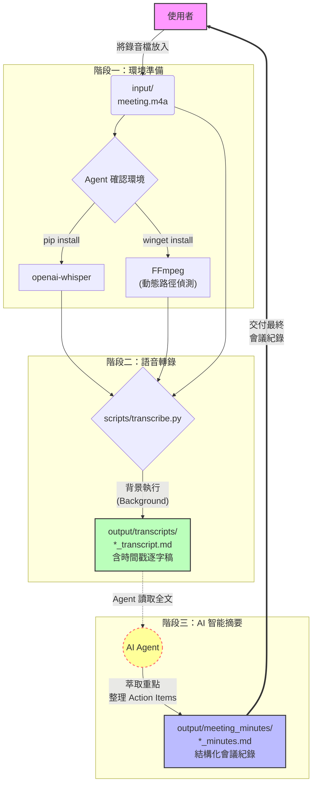

# 🎙️ AudioTranscriptWorkflow — 語音轉逐字稿 & 會議紀錄自動化工作流

使用本地端 **openai-whisper** 將錄音語音全自動轉錄為 Markdown 逐字稿，並由 AI Agent 智能摘要成結構化會議紀錄。全程離線運作，無需上傳任何雲端 API，保護敏感會議內容。

## ✨ 特色

- **全程本地化**：使用 openai-whisper 模型，音訊不離開本機
- **動態環境偵測**：自動尋找 FFmpeg 安裝路徑，免手動設定環境變數
- **相對路徑設計**：不寫死絕對路徑，搬移目錄後依然可用
- **雙份產出**：自動生成逐字稿 + AI 整理後的結構化會議紀錄
- **GPU 自動加速**：偵測到 NVIDIA GPU 即自動使用 CUDA 加速

## 📂 目錄結構與檔案用途

```text
AudioTranscriptWorkflow/
├── SKILL.md                  ← AI Agent 唯一入口與執行 SOP
├── README.md                 ← 本文件
├── requirements.txt          ← Python 相依套件
├── scripts/
│   └── transcribe.py         ← 核心轉錄腳本（接受命令列參數）
├── input/                    ← 🎵 【放置音檔的目錄】.m4a / .mp3 放這裡
├── output/
│   ├── transcripts/          ← 📄 【逐字稿輸出位置】自動加時間戳命名
│   └── meeting_minutes/      ← 📋 【會議紀錄輸出位置】Agent 整理後存放
└── examples/
    └── sample_meeting_minutes.md  ← 虛構的示範會議紀錄
```

## 🚀 快速開始

```bash
# 1. 安裝相依套件
pip install -r requirements.txt

# 2. 將音檔放入 input/ 目錄
# 例：input/meeting_2024-03-15.m4a

# 3. 執行轉錄腳本 (以相對路徑指定輸入與輸出)
python scripts/transcribe.py "input/meeting_2024-03-15.m4a" "output/transcripts/meeting_2024-03-15_transcript.md"

# 4. 由 AI Agent 讀取逐字稿後，自動產出會議紀錄至 output/meeting_minutes/
```

## 📁 輸入與輸出說明

| 項目 | 目錄位置 | 說明 |
|------|----------|------|
| 🎵 音檔來源 | `input/` | 放置 `.m4a`、`.mp3`、`.wav` 等格式的錄音檔 |
| 📄 逐字稿 | `output/transcripts/` | Whisper 轉錄的完整逐字稿，含時間戳記 |
| 📋 會議紀錄 | `output/meeting_minutes/` | Agent 整理後的結構化紀錄，含 Action Items |

> ⚠️ `input/` 與 `output/` 目錄內含敏感會議音訊與逐字稿，**切勿上傳至版本控制**（已寫入 `.gitignore`）。

## 🏛️ 工作流程架構



## 📦 相依套件與核心技術 (Dependencies)

- **[openai-whisper](https://github.com/openai/whisper)**：OpenAI 開源的本地語音識別模型，支援多語言，無需 API 金鑰。
- **[FFmpeg](https://ffmpeg.org/)**：跨平台音訊處理工具，由 Whisper 底層調用，支援 m4a、mp3 等格式解碼。
